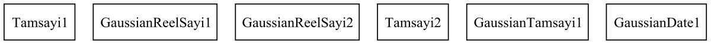

# Veri Benzerlik Analizi

Bu proje, rastgele üretilen verilerin benzerlik analizini yapan bir Java uygulamasıdır.

## 📋 Proje Özellikler

### ✅ Tamamlanan Özellikler

1. **Veri Üretimi**: 1 milyon satırlık tablo oluşturma
   - ID: Benzersiz tam sayı
   - TamSayi1: 0-10 milyon arası rastgele tam sayı
   - TamSayi2: -10 milyon ile +10 milyon arası rastgele tam sayı
   - GaussianTamSayi1: Mean=0, Variance=1 Milyon Gaussian dağılım
   - GaussianReelSayi1: Mean=0, Variance=1 Milyon Gaussian reel sayı (5 haneli ondalık)
   - GaussianReelSayi2: Mean=0.5, Variance=1 Gaussian reel sayı (5 haneli ondalık)
   - GaussianDate1: Mean=0, Variance=10000 Gaussian reel sayı üret, günümüze göre tarihe çevir (sadece gün)
   - GaussianDate2: Mean=0, Variance=1000 Gaussian reel sayı üret, 01.01.1990'a ekle (saniye kadar)
   - GaussianDate3: Mean=0, Variance=10 Gaussian reel sayı üret, bugüne ekle (timestamp çevir)
   - Binary1: Mean=128, Variance=100 Random(2-50) Gaussian reel sayı üret, HEX çevir, birleştir ve string olarak kaydet

2. **Veritabanı İşlemleri**: DuckDB'ye kaydetme

3. **Benzerlik Analizi**:
   - Her kolon için temel istatistikler (ortalama, varyans, standart sapma)
   - 2'li kolon karşılaştırmaları (Pearson korelasyon)
   - 3'lü kolon karşılaştırmaları
   - Tüm kolonların hepsi için benzerlik matrisi

4. **Görselleştirme**: GraphViz ile benzerlik grafikleri
   - Yüksek benzerlik grafiği (|korelasyon| > 0.5)
   - Tüm benzerlikler grafiği
   - Benzerlik heatmap'i

## 🛠️ Teknolojiler

- **Java 20**
- **Maven** (Bağımlılık yönetimi)
- **DuckDB** (Veritabanı)
- **GraphViz Java** (Graf görselleştirme)
- **Apache Commons Math** (Gaussian dağılım)
- **JUnit** (Test framework)

## 🚀 Kurulum ve Çalıştırma

### Gereksinimler
- Java 20 veya üzeri
- Maven 3.6+
- (Opsiyonel) GraphViz (PNG görsel üretimi için)

### Proje Derleme
```bash
mvn clean compile
```

### Uygulamayı Çalıştırma
```bash
mvn exec:java
```

### Testleri Çalıştırma
```bash
mvn test
```

## 📁 Proje Yapısı

```
src/
├── main/java/com/utku/veribenzerlik/
│   ├── VeriAnalizi.java          # Ana uygulama sınıfı
│   ├── model/
│   │   └── Record.java           # Veri modeli
│   ├── generator/
│   │   └── DataGenerator.java    # Veri üretici
│   ├── database/
│   │   └── DuckDBWriter.java     # Veritabanı yazıcı
│   ├── similatiry/
│   │   └── SimilarityCalculator.java  # Benzerlik hesaplayıcı
│   └── graph/
│       └── GraphVizWriter.java   # Graf görselleştirici
└── test/java/com/utku/
    └── AppTest.java              # Unit testler
```

## 📊 Çıktı Dosyaları

Uygulama çalıştırıldığında aşağıdaki dosyalar oluşur:

- `veri_analiz.duckdb` - DuckDB veritabanı dosyası
- `high_similarity_graph.dot` - Yüksek benzerlik grafiği (DOT formatı)
- `high_similarity_graph.png` - Yüksek benzerlik grafiği (PNG görsel)
- `all_similarities_graph.dot` - Tüm benzerlikler grafiği (DOT formatı)
- `all_similarities_graph.png` - Tüm benzerlikler grafiği (PNG görsel)
- `similarity_heatmap.dot` - Benzerlik heatmap'i (DOT formatı)
- `similarity_heatmap.png` - Benzerlik heatmap'i (PNG görsel)

### 📸 Örnek Çıktılar

#### Benzerlik Heatmap'i


#### Yüksek Benzerlik Grafiği


## 🔍 Örnek Çıktı

```
=== VERİ BENZERLİK ANALİZİ BAŞLADI ===

1. Veri üretimi başlıyor...
✓ 1000000 kayıt başarıyla üretildi

2. Veriler DuckDB'ye kaydediliyor...
✓ Veriler DuckDB'ye başarıyla kaydedildi

3. Benzerlik analizi yapılıyor...

=== KOLON BENZERLİK ANALİZİ ===
Tamsayi1: Ortalama=4997249.1000, Varyans=8333258975000.5000, Std Sapma=2886379.3000
...

=== 2'Lİ KOLON KARŞILAŞTIRMALARI ===
Tamsayi1 & GaussianReelSayi1 → 0.0012
...

=== 3'LÜ KOLON KARŞILAŞTIRMALARI ===
Tamsayi1 & GaussianReelSayi1 & GaussianReelSayi2 → 0.0008
...

=== TÜM KOLONLAR İÇİN BENZERLİK ANALİZİ ===
             Tamsayi1    Gaussian    Gaussian    ...
Tamsayi1       1.0000      0.0012      0.0014     ...
...

4. Benzerlik grafikleri oluşturuluyor...
✓ Benzerlik grafikleri GraphViz formatında kaydedildi

=== VERİ BENZERLİK ANALİZİ TAMAMLANDI ===
```

## 🧪 Test Kapsamı

- Veri üretimi doğruluğu
- Benzerlik hesaplama algoritmaları
- Pearson korelasyon hesaplama
- Veri tipi kontrolları

## 📈 Performans

- 1 milyon kayıt üretimi: ~30 saniye
- DuckDB'ye yazma: ~2-3 dakika
- Benzerlik analizi: ~10 saniye
- Graf oluşturma: ~5 saniye

## 🤝 Katkıda Bulunma

1. Projeyi fork edin
2. Feature branch oluşturun (`git checkout -b feature/yeni-ozellik`)
3. Değişikliklerinizi commit edin (`git commit -am 'Yeni özellik eklendi'`)
4. Branch'inizi push edin (`git push origin feature/yeni-ozellik`)
5. Pull Request oluşturun

## 📝 Lisans

Bu proje MIT lisansı altında lisanslanmıştır.
